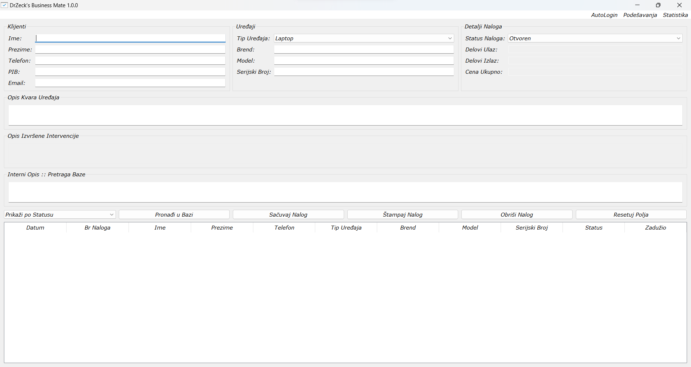
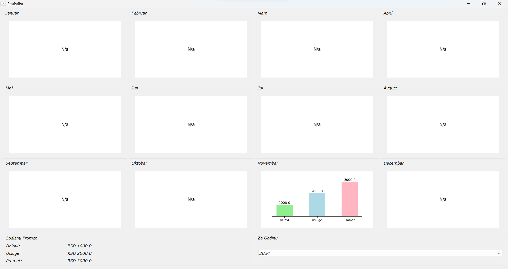
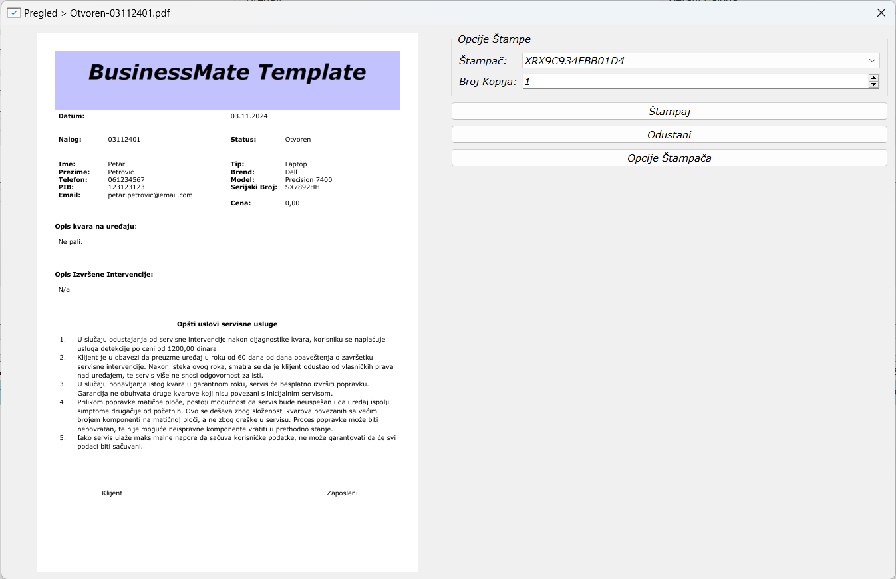
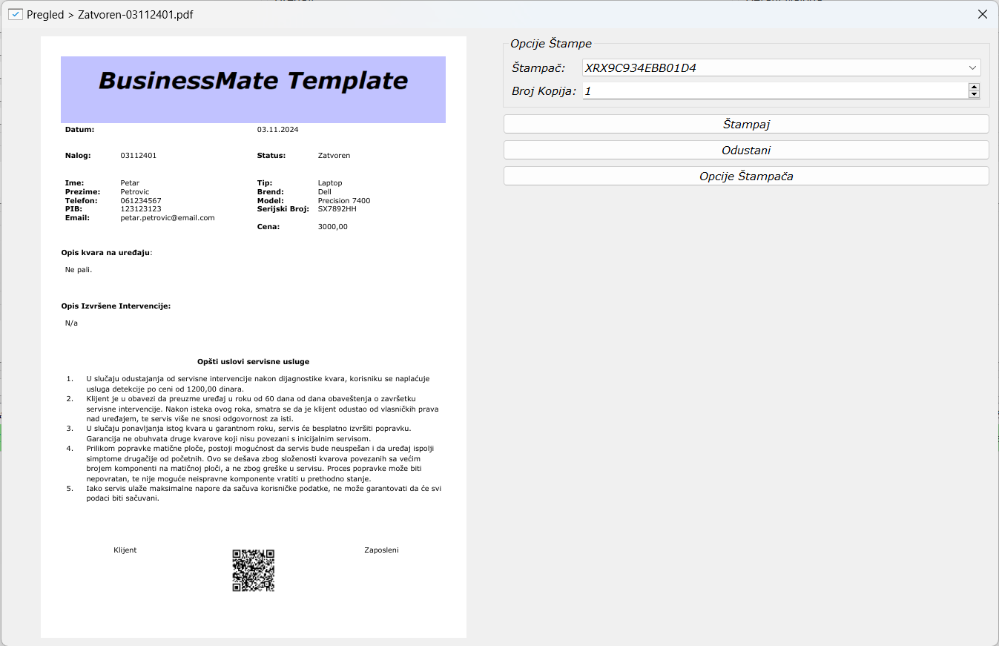

# BusinessMate - Uputstvo za Korišćenje

**BusinessMate** je aplikacija za upravljanje poslovnim procesima, dizajnirana da pomogne u vođenju radnih naloga, upravljanju klijentima i uređajima, kao i generisanju mesečnih statistika. Aplikacija je jednostavna za korišćenje, a svi podaci se čuvaju lokalno u bazi podataka i PDF fajlovima.

## Instalacija

### Preuzimanje i Instalacija
- Aplikaciju preuzmite u sekciji **Releases.**

### Aktivacija
- **Prvo Pokretanje**: Aplikacija će zahtevati unos ključa.
- Unesite svoj ključ i kliknite na **Aktiviraj**. Ako je ključ ispravan, aplikacija će se aktivirati.

## Prijava i Registracija
- **Prijava**: Unesite korisničko ime i lozinku da biste se prijavili. Ako je ovo prvi put da koristite aplikaciju, moraćete da registrujete administratora.
- **Registracija**: Ako je administrator već registrovan, možete dodavati nove korisnike.

## Glavni Prozor
Glavni prozor aplikacije omogućava Vam da unosite i upravljate podacima o klijentima, uređajima i radnim nalozima.

### Klijenti
- Unesite podatke o klijentu, kao što su:
  - Ime
  - Prezime
  - Telefon
  - PIB
  - E-mail

### Uređaji
- Izaberite tip uređaja i unesite:
  - Brend
  - Model
  - Serijski broj

### Detalji Naloga
- Unesite cene za delove i ukupnu cenu intervencije.
- Unesite opis izvršenih intervencija na uređaju.

### Status Naloga
- **Otvoren**: Unos novog klijenta/uređaja u bazu podataka.
- **Zatvoren**: Ažuriranje postojećeg naloga nakon izvršenih intervencija.
- **Odložen**: Ažuriranje postojećeg naloga usled nabavke delova ili čekanja delova.

**Napomena**: Samo statusi **Zatvoren** i **Odložen** ažuriraju naloge u bazi. Status **Otvoren** uvek pravi novi unos u bazi, što omogućava unos istog ili novog uređaja za postojećeg klijenta bez ponovnog upisivanja podataka klijenta.

### Čuvanje i ažuriranje
- Kliknite na **Sačuvaj Nalog** da biste snimili podatke.
- Da biste ažurirali postojeći nalog, selektujte ga iz tabele, napravite izmene i kliknite na **Sačuvaj Nalog**.

## Brisanje naloga *Dostupno samo administratoru.
- Izaberite nalog i kliknite na **Obriši Nalog**.

### Štampanje i Pregled PDF-a
- Učitajte nalog iz baze i kliknite na **Štampaj Nalog** da odštampate radni nalog.
- PDF fajl se može pregledati i štampati korišćenjem ugrađenog PDF pregledača.

## Statistika *Dostupno samo administratoru.
- **Statistika:** Grafički prikaz cele godine po mesecima. 
- **Godišnji prikaz:** u donjem levom uglu prozora samo numerički.
- **Odabir godine:** Trenutna godina (default prikaz) sa opcijom za poslednjih 5 godina (padajući meni) u donjem desnom uglu prozora.

## Podešavanja *Dostupno samo administratoru.
- **IPS Podaci**: Unesite podatke o firmi i broju računa. Ovi podaci će biti korišćeni za generisanje IPS QR koda.
- **Otvaranje Template-a**: Kliknite na **Otvori Template Nalog** da biste uredili Word template za radne naloge.
- Template se otvara sa default aplikacijom za rad sa office dokumentima koju imate instaliranu na računaru.

## Automatska Prijava
Aplikacija podržava automatsku prijavu logovanog korisnika. Ovo podešavanje se može promeniti u meniju aplikacije.

## Lokacija dokumenata i baze
- Podaci se čuvaju u `business_mate.db` bazi podataka koja se nalazi u:
- **C:\Users\VAŠ_KORISNIČKI_NALOG\Documents\BusinessMate\DB**
- Radni nalozi se čuvaju u folderu:
- **C:\Users\VAŠ_KORISNIČKI_NALOG\Documents\BusinessMate\Radni Nalozi**

### Interfejs

### Statistika

### Prijemnica

### Otpremnica

## License
This software is proprietary and **not** open source.

